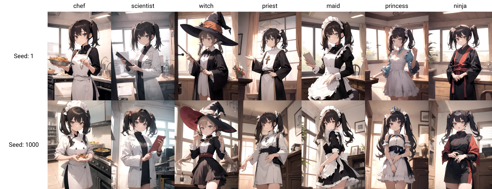

# 莉沫酱的随机融合模型！

事情是这样的，最近我测试了不少网上的stable diffusion的动漫风格模型。

其中有1些模型的效果还不错，不过它们各自都有些缺点，于是我就想，那我来做1个天衣无缝的模型好了！

原理是这样的，有两个假设: 

- 合并模型的权重不会引入额外的过拟合。

- 在符合语义方面表现得更好的模型在其他方面也能表现得更好。

嘛，直觉上是这样，第1个假设应该是对的，第2个……我不好说。要是问我为什么我就回答「有人托梦给我」。

总之，这样1来，我们只需要1个特定的指标，然后在各个模型加权得到的空间里暴力搜索，找出1份指标最高的权重就可以了！


## 效果

测试用的prompt是这样: 

```txt
{什么职业}, indoors, twintails, cowboy shot
```

完整的参数是: 

```txt
chef,
indoors, twintails, cowboy shot
Negative prompt: (worst quality, low quality:1.4)
Steps: 50, Sampler: DPM++ 2M SDE Karras, CFG scale: 7, Seed: 1, Size: 512x704, Model hash: 1a2f3cebaa, Model: rimochan_random_mix, VAE hash: 500ea30284, VAE: blessed2.vae.safetensors, Eta: 0.68, Script: X/Y/Z plot, X Type: Prompt S/R, X Values: "chef,scientist,witch,priest,maid,magical girl,ninja", Version: v1.7.0
```

生成的图片是这样:




## 模型下载

Github的LFS超过1G居然要收钱！所以我就把模型传到Civitai了，下载的链接在这里:

<https://civitai.com/models/249129>


## 训练步骤

你们可能会奇怪说，这个仓库里面是不是应该有训练代码，是不是我故意把代码藏起来了……其实不是，我本来也想自动搜索，但是stable-diffusion-webui这个仓库恰好没有提供merge checkpoint的接口，所以干脆就退化成大部分用手工处理、少部分用脚本了。

测指标的仓库是这个: <https://github.com/RimoChan/stable-diffusion-anime-tag-benchmark>，测的指标是每张图32标签下的平均准确率。

具体操作是这样: 

1. 我在网上下载了大约40个模型，给他们分别测指标，选出指标最高的10个模型。

2. 对选出的模型随机合并checkpoint，这里因为是手工处理的，所以随机操作实际上是看我的心情，点到哪个就是哪个。

3. 然后给合并出来的模型再测试1遍指标。

4. 选出新模型里指标最高的2个，加进原本的10个模型的list中。

5. 回到步骤2，2~5总共重复3次。

6. 选出指标最高的那个模型。

操作下来，最终确实可以得到1个看起来指标不错的模型，而且比第2名要高出不少，具体的数值可以回到指标的那个仓库看结果。

不过之后准备再看1下stable-diffusion-webui的代码，看看能不能帮它加上merge的接口或者怎么绕过去。这样1来，就可以用1个脚本把这些事都自动做掉，也有更长的时间让它慢慢搜索更好的合并权重啦！


## 结束

好，就这样，大家88，我要回去和`1girl`亲热了！

还有我突然想起来天衣无缝，那天衣其实是乳胶衣吧！
